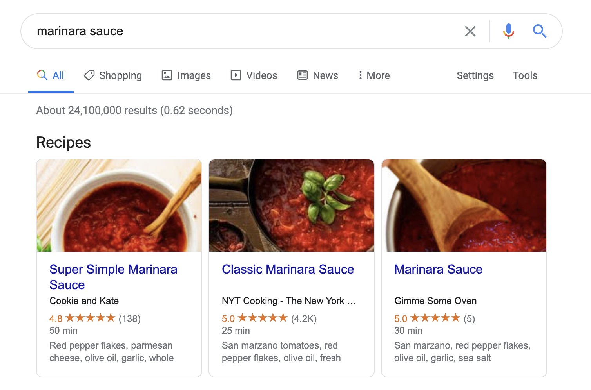
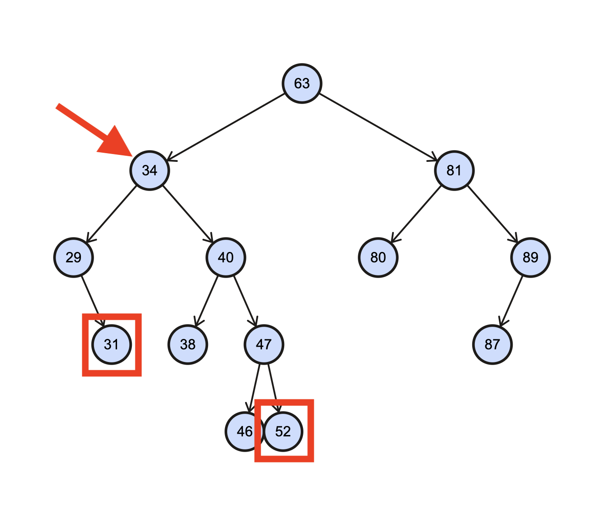
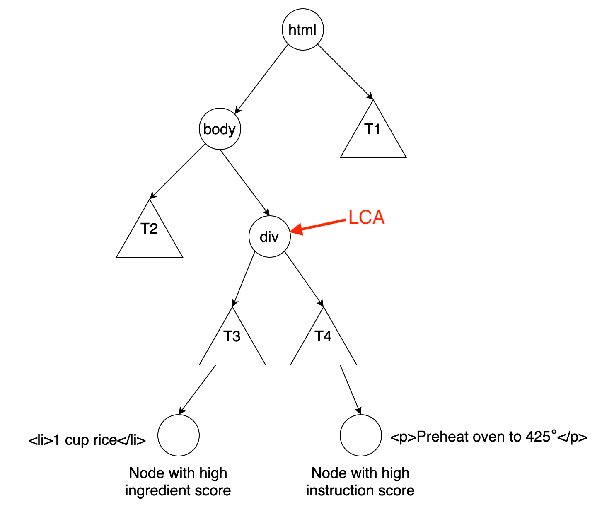

The recipe importer is one of the most important features of [Saffron](http://mysaffronapp.com/). It allows a user to input a URL and it will attempt to extract the recipe content from that website.

`video: title: "Import Recipe Saffron" ./add-recipes.mp4`

Behind the scenes, 2 things occur:

1. A request is sent to the website to get the HTML
2. The HTML is parsed into fields like ingredients, instructions, title, etc...

Let's dig into how each one of these works.

## Fetching the HTML

Nothing fancy going on here, just using [node-fetch](https://github.com/node-fetch/node-fetch).

```js
import fetch from "node-fetch"

const html = await fetch("https://example.com").then(x => x.text())
```

Once in a while, a recipe site will use client side rendering or block “bot” requests and this method won't work. However, this doesn’t come up enough to warrant using something like [puppeteer](https://github.com/puppeteer/puppeteer).

## Extracting the Recipe

Roughly 75% of websites users choose to import are easy to parse, but for the remaining 25% a more advanced technique is required.

### The Easy Way

Ever wonder how Google creates these cards when you search for a recipe?



It turns out, Google will show these cards when a website includes some [standard recipe metadata](https://developers.google.com/search/docs/data-types/recipe).

As a result, nearly every popular recipe website will include metadata on what the title, servings, ingredients, instructions, etc... are for a recipe (this also occurs for recipes in foreign languages).

For these websites, no guessing is involved. Reading the metadata is all that is needed.

To do that, the HTML is searched for a `script` tag with the type `application/ld+json` which contains the metadata in a big JSON blob.

```js
<script type="application/ld+json">
  {
    "@context": "http://schema.org",
    "@type": "Recipe",
    "name": "Classic Marinara Sauce",
    "recipeIngredient": [
      "1 28-ounce can whole tomatoes",
      "1/4 cup olive oil",
      "7 garlic peeled and slivered",
      "Small dried whole chile",
      "1 teaspoon kosher salt",
      "1 large fresh basil sprig"
    ]
    // more fields
  }
</script>
```

This format is known as [JSON-LD](https://json-ld.org/).

If that doesn't exist, the HTML is traversed for tags annotated with `itemprop`.

```html
<h1 itemprop="name">Simple Marinara Sauce</h1>
<div>
  <span itemprop="recipeIngredient">2 cans stewed tomatoes</span>
  <span itemprop="recipeIngredient">1 teaspoon dried oregano</span>
  <span itemprop="recipeIngredient">1 teaspoon salt</span>
</div>
```

This format is known as [Microdata](https://developer.mozilla.org/en-US/docs/Web/HTML/Microdata).

There are libraries like https://github.com/digitalbazaar/jsonld.js/ to parse JSON-LD + Microdata for you.

### The Hard Way

Identifying ingredients and instructions in arbitrary HTML is the trickiest step, so I'll save that for last. We'll first start off with how the other fields are extracted.

1. Name of recipe

The `og:title` meta tag is used. If that doesn't exist, the title tag is used instead.

```html
<head>
  <meta property="og:title" content="Spaghetti Bolognese" />
</head>
```

2. Picture

All the images are collected that are within the body tag. Then smaller images are removed, and the user picks the correct image from the remaining options.

3. Times

Cook and prep time are currently ignored.

4. Servings

Each HTML tag is considered until one is found with text that includes `makes:`, `serves:`, `servings:`, or `yield:`.

<div class="line" ></div>

Ok, let's talk about the technique used to find the ingredients and instructions.

HTML can be represented in a tree structure where the children of a HTML tag become the children of a node in the tree.

So the following HTML:

```html
<body>
  <nav>
    <a>home</a>
  </nav>
  <p>more stuff</p>
</body>
```

Can be represented as the following tree:

```
    body
    / \
   /   \
  p    nav
        |
        a
```

Using this concept, the HTML is traversed in a depth first search fashion, scoring nodes on how likely they are to be an instruction/ingredient based on the text inside of them.

Criteria for scoring how likely some text is an instruction:

- Does it start with a capital letter?
- Does it end in punctuation?
- Is it longer than 100 characters?
- Is there a capital letter anywhere in the text?
- Does it use any instructional words specific to cooking like: "Sprinkle", "Mix", "Heat", etc...

Criteria for ingredients:

- Is the text short?
- Does it contain too many sentences?
- Does it use any words that are food items like "salt", "olive oil", "butter", etc...
- Does it start with a number? (e.g. 3 cups of rice)
- Does it contain a unit like "cup", "lb", "oz", etc...

This step is complete once two separate nodes are found. One with a high instruction score, and the other with a high ingredient score.

Next, the lowest common ancestor (LCA) is computed from the 2 nodes.

If your unfamiliar with LCA, here's the definition from [Wikipedia](https://en.wikipedia.org/wiki/Lowest_common_ancestor):

> In graph theory and computer science, the lowest common ancestor of two nodes v and w in a tree or directed acyclic graph T is the lowest node that has both v and w as descendants

I like to think of it as the first shared parent the 2 nodes have. Here's a good visual of it:



So the LCA of 2 HTML nodes looks something like this:



(the triangles are subtrees)

This is useful to compute because in most cases, the LCA node will contain all of the ingredients/instructions and all other HTML can be ignored.

At this point, the ingredients and instructions are assumed to be inside the LCA node, but there are usually additional nodes that are not useful.

To help filter them out, 2 other assumptions are made:

1. Ingredients come before instructions in the HTML.

This means everything before the first ingredient node will be ignored.

```html
<div>
  <!-- start ignore -->
  <div>
    Serve it up with your favorite pasta, pizza, lasagna, meatballs, parmigiana,
    subs, or whatever sounds good.
  </div>
  <div>
    So many good reasons to make this marinara sauce…so let’s do it!
  </div>
  <!-- end ignore -->
  <!-- first ingredient node -->
  <div>1 cup tomatoes</div>
  <div>salt</div>
  <!-- instructions -->
  <div>
    Throw stuff in a pot.
  </div>
</div>
```

2. The ingredients and instructions are in 2 contiguous blocks.

```html
<div>
  <!-- start contiguous ingredient block -->
  <ul>
    <li>1 cup tomatoes</li>
    <li>salt</li>
  </ul>
  <!-- end contiguous ingredient block -->

  <!-- start contiguous instructions block -->
  <div>
    Throw stuff in a pot.
  </div>
  <div>
    Stir it.
  </div>
  <!-- end contiguous instructions block -->
</div>
```

Therefore, all nodes between 2 ingredient nodes are assumed to be ingredients (helpful for detecting weird ingredients).

```html
<ul>
  <li>1 cup rice</li>
  <!-- start assumed ingredients -->
  <li>Cardoon</li>
  <li>Gurnard (pick the black belly).</li>
  <!-- end assumed ingredients -->
  <li>1 teaspoon salt</li>
</ul>
```

The same principle applies to instructions.

Using these assumptions, the final step involves traversing the children of the LCA node. Each node's is checked to see if it belongs to the ingredients block, the instructions block, or should be ignored altogether.

The score from before is considered in combination with the class name, tag (whether it's a div, span, h1, etc...), and parent tags.

Not all the conditions need to be met as long as it reaches a certain threshold. It's better to be more flexible and include a little extra info than to be stricter and sometimes miss an ingredient.

When the blocks have been determined, the ingredients/instructions can be extracted and the algorithm is done.

### Results

Surprisingly, using heuristics like this performs quite well on the average recipe site/blog.

To give you an idea of some websites that parse successfully, here are a couple test cases used:

- https://www.hungryforever.com/recipe/mutton-rara-recipe/amp/
- https://www.islandsmile.org/mutton-curry/
- https://thespiceadventuress.com/2015/12/10/slow-cooked-lamb-curry/amp/
- https://ashishbhatia3.wordpress.com/2015/01/21/dhabe-ka-gosht-highway-lamb-curry/amp/
- https://whatcharlottebaked.com/2019/01/26/black-forest-naked-cake/
- https://www.cardamomandtea.com/blog/whole-roast-cauliflower-with-sabzi-khordan
- https://www.taste.com.au/recipes/middle-eastern-lamb-pilaf/f974cdc0-e32e-4bdb-8227-df5fab95fd31?r=quickeasy/mfQ7EL9o
- http://thecinnaman.com/pumpkin-olive-oil-and-orange-cake/
- http://adamliaw.com/recipe/ramen-school-006-rich-double-soup-for-ramen/
- https://www.feedtheswimmers.com/blog/2019/6/5/carottes-rapps-with-rice-and-sunflower-seeds

Situations still come up where it doesn't extract the ingredients/instructions correctly, like this website: http://www.cookingforengineers.com/recipe/195/Chocolate-Truffles

But more often, a recipe import will fail because:

- a user inputs a URL to a website that doesn’t have a recipe on it
- the request times out (7 seconds)
- the website uses client side rendering, so the content is not in HTML.

## Conclusion

Using a combination of heuristics and reading metadata, Saffron is able to import recipes from almost any website.

If you'd like to give this a try for yourself, you can check it out at https://www.mysaffronapp.com.
